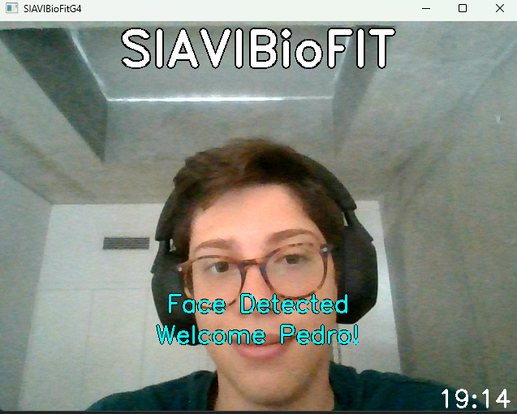
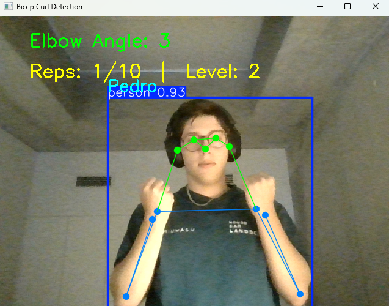

# SiaviBIO Fit

A fitness app that combines facial recognition, voice recognition, and gesture detection for a personalized and effective experience! Users are authenticated using facial data, and can use the app to count their repetitions of 3 different exercises: bicep curls, jumping jacks, and lateral raises.

Users can control everything inside the app using their voice, by using english commands. In fact, the user registration is done entirely using voice commands!

|  |  |
|----------------------------------------|----------------------------------------|

## Dependencies 
|Technology|Library|
|-----------|-------|
| GUI | [CustomTkinter](https://customtkinter.tomschimansky.com/)     |
| Voice Recognition       | [VOSK Models/API](https://alphacephei.com/vosk/models)    |
| Facial Recognition | [Facial Recognition Python Library](https://github.com/ageitgey/face_recognition) |
| Gesture Detection | [YOLO Pose Estimation](https://docs.ultralytics.com/tasks/pose/) |


## Running the application

First, clone this repository into your machine:
```bash
git clone https://github.com/campiao/siavi-bio-fit.git 
```

Ideally, you would want to create a new Python virtual environment for this project. After that, download all of the needed dependencies:

```bash
pip install -r biofit\requirements.txt
```

Finally, start the application using:
```bash
python .\biofit\main.py 
```

## License
MIT License

Copyright (c) 2025 Pedro Campião, Catarina Teixeira, Rui Teixeira

Permission is hereby granted, free of charge, to any person obtaining a copy
of this software and associated documentation files (the "Software"), to deal
in the Software without restriction, including without limitation the rights
to use, copy, modify, merge, publish, distribute, sublicense, and/or sell
copies of the Software, and to permit persons to whom the Software is
furnished to do so, subject to the following conditions:

The above copyright notice and this permission notice shall be included in all
copies or substantial portions of the Software.

THE SOFTWARE IS PROVIDED "AS IS", WITHOUT WARRANTY OF ANY KIND, EXPRESS OR
IMPLIED, INCLUDING BUT NOT LIMITED TO THE WARRANTIES OF MERCHANTABILITY,
FITNESS FOR A PARTICULAR PURPOSE AND NONINFRINGEMENT. IN NO EVENT SHALL THE
AUTHORS OR COPYRIGHT HOLDERS BE LIABLE FOR ANY CLAIM, DAMAGES OR OTHER
LIABILITY, WHETHER IN AN ACTION OF CONTRACT, TORT OR OTHERWISE, ARISING FROM,
OUT OF OR IN CONNECTION WITH THE SOFTWARE OR THE USE OR OTHER DEALINGS IN THE
SOFTWARE.


